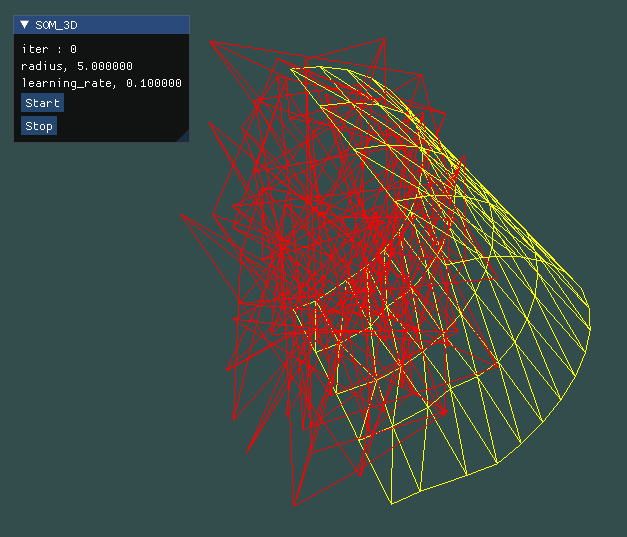
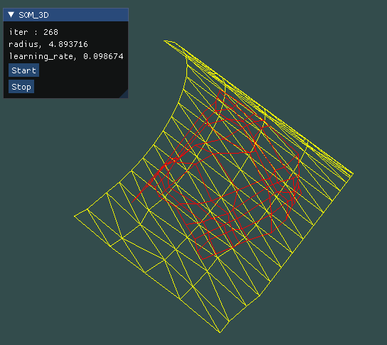
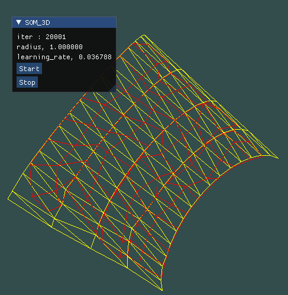

# Self-Organizing Map 3D Demo (STL)

###### 要貼到3D圖形上辣~~ ######

### 初始化
* lattice是10 * 10隨機生成的網格
* inputdata是用blender做出後再轉乘stl檔，利用自己寫的讀取stl的程式把檔案讀進去，因為stl裡都是三角片，所以繪畫時用GL_TRIANGLES
* 總迭代次數為20000
* 畫面
    * 左邊顯示目前的迭代次數、收縮半徑、學習比率
    * 有按鈕開始即暫停
* 圖形
	* 把所有的stl檔都放在stl資料夾裡，在儲存stl檔時要記得案ascii才可成功讀檔
* 繪畫
    * lattice
    ```
        glPolygonMode(GL_FRONT_AND_BACK,GL_LINE);
        glBindVertexArray(lattice_square_four_edges.VAO);
        glDrawArrays(GL_LINES, 0, world.lattice_square_four_edges.size());
    ```
    * dataset
    ```
        glPolygonMode(GL_FRONT_AND_BACK,GL_LINE);
		glBindVertexArray(stlmodel.VAO);
		glDrawArrays(GL_TRIANGLES, 0, stlModel.triangleNum);
    ```
* 操作

| 按鈕  |	 效果	   |
| ---- |:-------------:|
| G    | 開始        |
| t    | 暫停        |
| F    | 鏡頭拉遠     |
| R    | 鏡頭拉近     |
| A    | 鏡頭向左     |
| D    | 鏡頭向右     |
| W    | 鏡頭向上     |
| S    | 鏡頭向下     |
| J    | 鏡頭向右旋轉  |
| L    | 鏡頭向左旋轉  |
| K    | 鏡頭向下旋轉  |
| I    | 鏡頭向上旋轉  |



### 開始執行



### 結果

* 最邊邊角角貼合的不是很好


